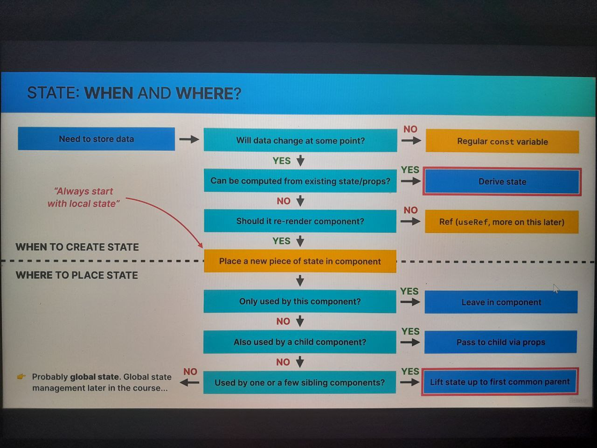

March 14, 2025

Section 6 No. 69

1. Starting a New Project: The "Far Away" Travel List
2. Building the Layout
3. Rendering the Items List

March 15, 2025

4. Building a Form and Handling Submissions
5. Controlled Elements (Technic) working with Form, this is not controlled by the DOM but by the REACT APP itself.
6. State vs. Props

- State
  Internal data, owned by component
  Component "Memory"
  Updating state causes component to re-render
  Used to make components interactive
- Props
  External data, owned by parent component
  Similar to fxn parameter
  Read-Only
  Receiving new props causes component to re-render. Usually when the parents state has been updated.

March 16, 2025

7. Exercise#1 FlashCards
8. Challenge#2 Date Counter v2
9. Section 7 - Thinking in React: State Management

- Thinking in React is a CORE SKILLS
  How to work w/React API + Thinking React (This is where professional react apps are built)
  a. React Mindset
  b. Thinking about components, state, data flow, effects, etc.
  c.Thinking is state transitions, not element mutations
- State Management
- When & Where to create state
- Derived state
- Lifting up state

The "THINKING IN REACT" PROCESS:
a. Break the desirec UI into components and establish a the component tree.
b. Build a static version in react (w/o state)
c. Think about state:
i. When to use state
ii. Types of state: local vs. global
iii. where to place each piece of state
d. Establish data flow:
i. One-way data flow
ii. Child-to-Parent communication
iii. Accessing global state

WHEN YOU KNOW HOW TO THINK IN REACT? Youll be able to answer:

- 🤔 How to break up a UI design into components?
- 🤔 How make some components reusable?
- 🤔 How to assemble UI from reusable components?
- 🤔 What pieces of state do I need for interactivity?
- 🤔 Where to place state? (What component should own of piece of state?)
- 🤔 What types of state can or should I use?
- 🤔 How to make data flow through app?

10. Fundamentals of State Management

- What is state management? Deciding when to create pieces of state, what types of state are necessary, where to place each piece of state, and how data flows through the app.
  ex. Giving a piece of state a home.
- Types of state: LOCAL vs. GLOBAL STATE?

- ✳️LOCAL
- 👉 State need only by one of few components
- 👉 State that is defined in component and only that component and child components have access tp ot) by passing via props)
- 👉 We should always start with local state
- 🌐GLOBAL
- 👉 State that many components might need
- 👉 Shared state that is accessible to every component in the entire application.
  Ex.
  UDEMY seach field - local state
  UDEMY Shopping cart & cart profile notif - global state

- State: When & Where?
  

11. Thinking About State and Lifting State Up
12. Reviewing "Lifting Up State"
    
    
    

March 19, 2025

13. Deleting an Item: More Child-to-Parent Communication!
14. Updating an Item: Complex Immutable Data Operation

March 20, 2025

15. Derived State
    
16. Calculating Statistics as Derived State
    gi

March 24, 2025

17. Sorting Items (3 different criteria, input, description, & packed)
18. Clearing the List

March 25, 2025

19. Moving Components Into Separate Files
